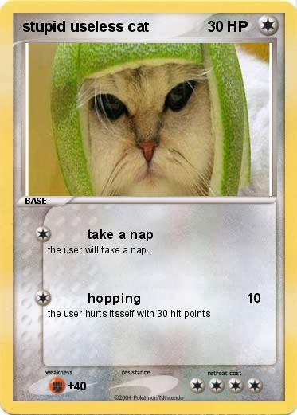
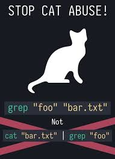

# USELESS - unix system  extremely late execution system



## Overview

This project allows to run programms after some delay specified in task file

"Execution" of each line from task file is pseudo-simultaneous, because the code is forked in necessary places.
The objective of the task was to use fork() to parallel code execution.

## Usage

1. *Compile*
```
g++ main.cpp -o useless
```

2. *Run*

```
./useless --help
```

```
./useless -f <path_to_task>
```

Task example is in `tast.txt`


> Project is educational and needs polishing.


